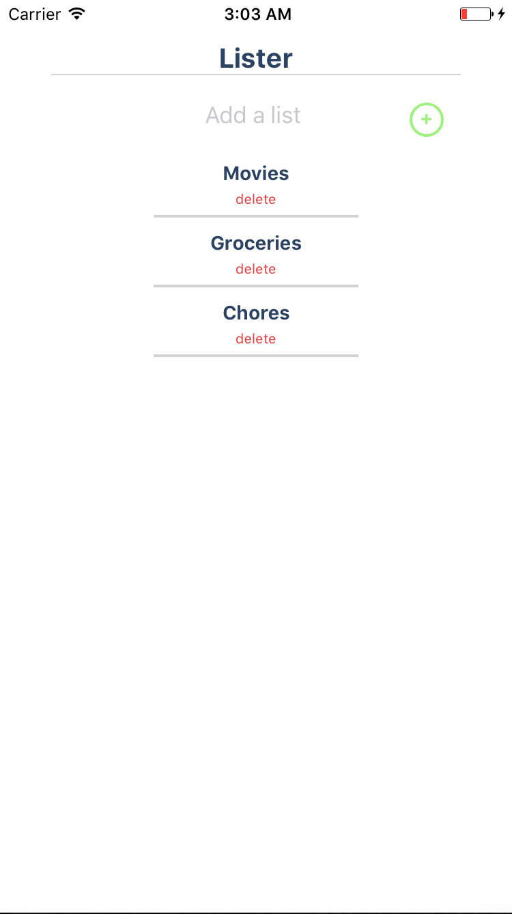
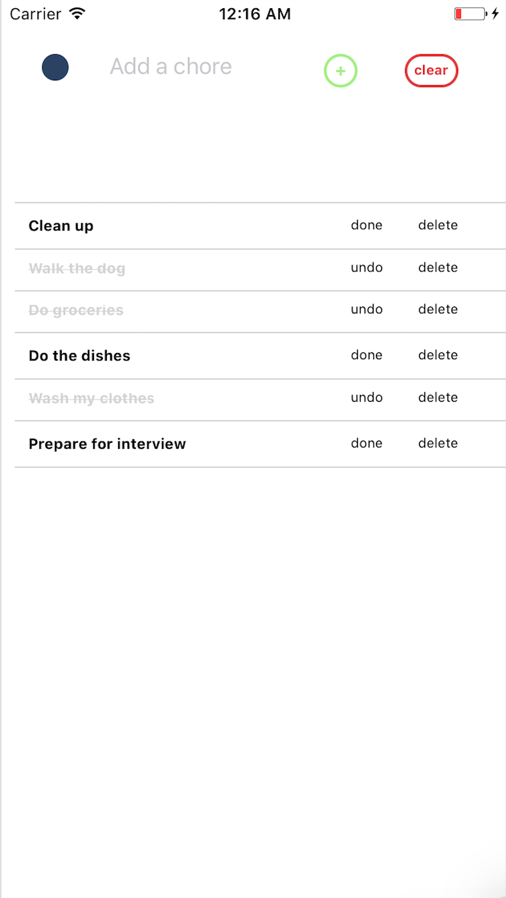

# todo-ios-app
A basic iOS ToDo app written in React Native alowing users to
 * Create/Delete lists
 * Create tasks inside tese lists
 * delete these tasks
 * mark them as done
 * clear the whole screen

